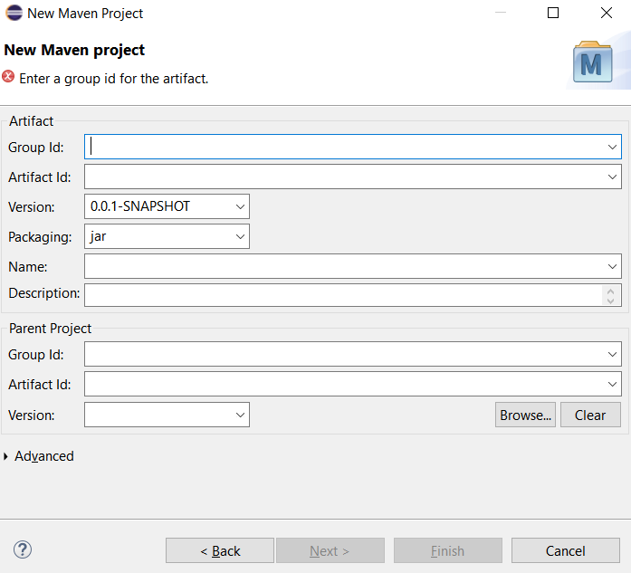
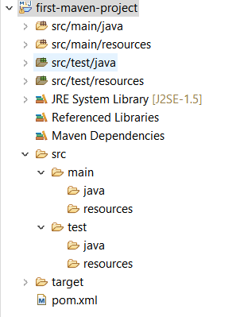

#1. Premier projet Maven avec Eclipse
- Ouvrir Eclipse
- File > New... > Projet.. > Maven > Maven project et Cliquer sur Next
- Cocher le "Create a simple project" et "Use default workspace locations" et Next
- Ensuite on a l'interface propre au projet Maven



Nous devons mettre tout d'abord:
* Group ID: le nom du package du projet. Il est important de comprendre que Maven utilise une convention pour les noms de  package (voir [ici](https://maven.apache.org/guides/mini/guide-naming-conventions.html)). Dans notre exemple, nous allons utiliser le nom `com.exomaven`
* Artifact Id: prend le nom du projet. dans notre cas, nous allons utiliser `first-maven-project`

Une fois rempli ces 2 éléments, nous allons clisuer sur `Finish`.


Le projet est alors construit et on retrouve une certaine structure comme suit:



Entre autres, on retrouve un fichier `pom.xml`. C'est la partie la plus importante d'un projet Maven.

Si on édite le fichier, on retrouve les éléments que nous avons définie auparavant: `groupId` et  `artifactId` dedans.

```xml
<project xmlns="http://maven.apache.org/POM/4.0.0" xmlns:xsi="http://www.w3.org/2001/XMLSchema-instance" xsi:schemaLocation="http://maven.apache.org/POM/4.0.0 https://maven.apache.org/xsd/maven-4.0.0.xsd">
  <modelVersion>4.0.0</modelVersion>
  <groupId>com.exomaven</groupId>
  <artifactId>first-maven-project</artifactId>
  <version>0.0.1-SNAPSHOT</version>
</project>
```