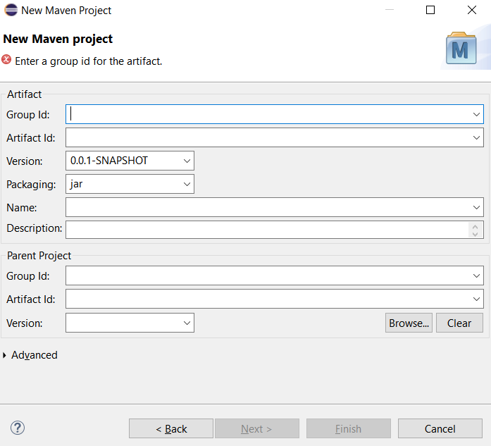
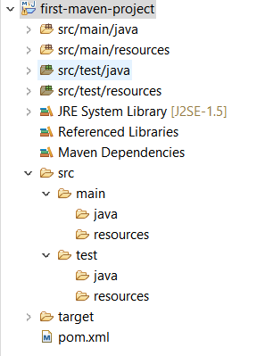
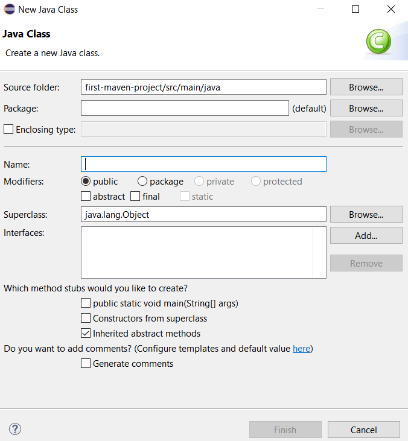
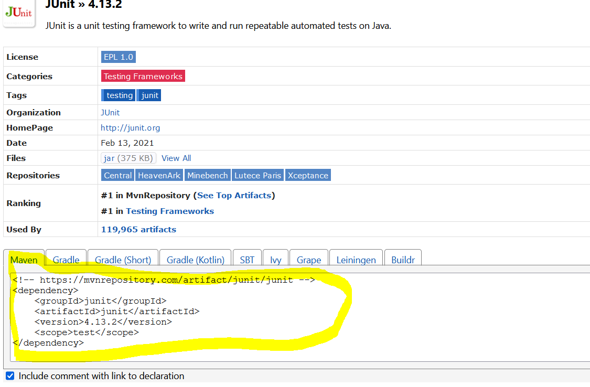
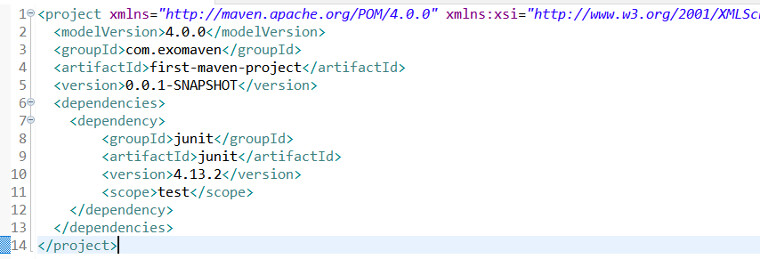
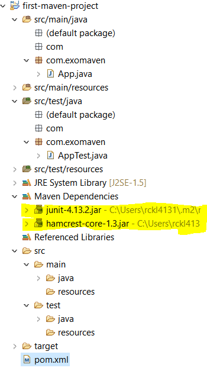
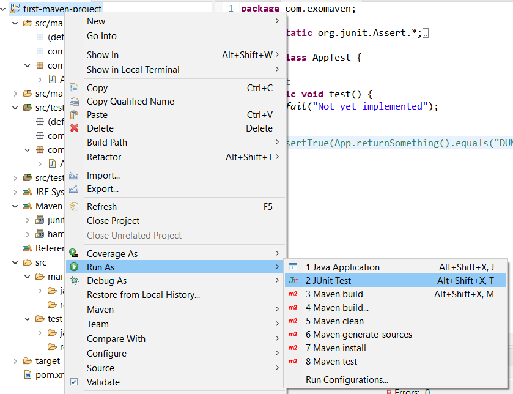
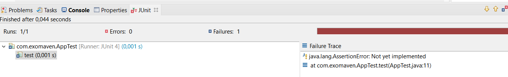
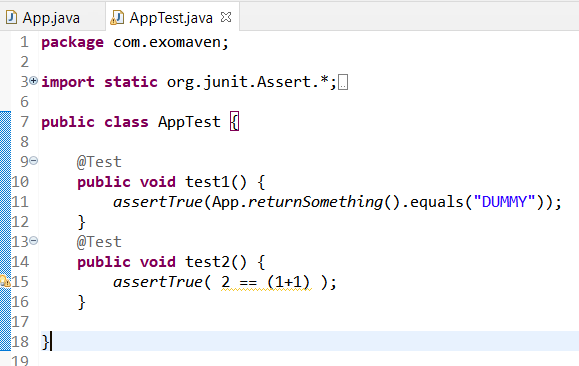
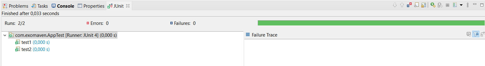

#1. Premier projet Maven avec Eclipse
- Ouvrir Eclipse
- File > New... > Projet.. > Maven > Maven project et Cliquer sur Next
- Cocher le "Create a simple project" et "Use default workspace locations" et Next
- Ensuite on a l'interface propre au projet Maven



Nous devons mettre tout d'abord:
* Group ID: le nom du package du projet. Il est important de comprendre que Maven utilise une convention pour les noms de  package (voir [ici](https://maven.apache.org/guides/mini/guide-naming-conventions.html)). Dans notre exemple, nous allons utiliser le nom `com.exomaven`
* Artifact Id: prend le nom du projet. dans notre cas, nous allons utiliser `first-maven-project`

Une fois rempli ces 2 éléments, nous allons clisuer sur `Finish`.


Le projet est alors construit et on retrouve une certaine structure comme suit:



Entre autres, on retrouve un fichier `pom.xml`. C'est la partie la plus importante d'un projet Maven.

Si on édite le fichier, on retrouve les éléments que nous avons définie auparavant: `groupId` et  `artifactId` dedans.

```xml
<project xmlns="http://maven.apache.org/POM/4.0.0" xmlns:xsi="http://www.w3.org/2001/XMLSchema-instance" xsi:schemaLocation="http://maven.apache.org/POM/4.0.0 https://maven.apache.org/xsd/maven-4.0.0.xsd">
  <modelVersion>4.0.0</modelVersion>
  <groupId>com.exomaven</groupId>
  <artifactId>first-maven-project</artifactId>
  <version>0.0.1-SNAPSHOT</version>
</project>
```

# 2 Une première gestion de dépendance avec Maven
Dans cette partie, nous allons créer une classe Java (très simple) pour émuler l'utilisation de maven dans notre projet. 

Click-droit sur le répertoire `src/main/java` et cliquer sur `New > Class` (on a choisi `src`car c'est un fichier source code)



Taper un nom de package `com.exomaven` (on a choisi le même nom que le groupid).

Taper dans `Name`, le nom de la classe `App` et cliquer `Finish`. 

Cette opération nous a créé un fichier App.java dans le projet et quelques autres packages aussi.

## 2.1 Création d'une fonction à tester pour notre projet

Dans la class `App`, rajoutons une fonction simple:
```java
public String returnSomething(){
    return "DUMMY";
}
```
Cela fait en sorte que nous avons un code source qui fait quelque chose (ici retourne le mot "DUMMY" mais cela pourrait être plus complexe)

## 2.2 Création d'une classe de test unitaire pour notre code source
Nous allons créer un test unitaire (junit) pour ce bout de code source. 

Cliquer-droit sur la racine du projet `File>New>Other...` et taper Junit.
Renseigner le même nom de `Package` que définit dans le code source: `com.exomaven`.
Renseigner également le champ `Name` par `Apptest`.

Cliquer sur `Finish` et une fenêtre apparaîtra qui permettra de choisir si on doit modifier le `PATH` pour la librairie Junit. Pour l'instant, choisir `Not now` et `OK`.

Cela causera quelque erreurs de compilation car la dépendance `Junit` n'est pas disponible alors que nous l'utilisons.

Dans un cas manuel (c'est à dire sans l'utilisation de Maven), nous pouvons gérer nous-même les dépendances. Par exemple, on pourrait télécharger le fichier jar de `Junit`, l'ajouter au `Build PATH` dans Eclipse et essayer de résoudre les erreurs que nous avons. Si ensuite, nous partageons notre projet avec quelqu'un, il doit également refaire toute cette opération (télécharger le jar de Junit, paramétrer correctement le `Build PATH` d'Eclipse) avant de pouvoir compiler. 

L'autre approche est d'utiliser Maven pour la gestion des dépendances comme Junit. 

## 2.3 Ajout d'une dépendance dans Maven
Editer le fichier `pom.xml` et nous allons rajouter une section `<dependancy>` en dessous de `<version>`. Pour cela, rajouter une balise 
```xml
<dependencies>    
    <dependency>
        On rajoute notre dépendence ici
    </dependency>
</dependencies>
```
Dans la balise `<dependency>`,  il nous faut rajouter au moins 3 elements qui sont `<groupId>`, `<artifactId>` et `<version>` :
```xml
    <dependency>
        <groupId> </groupId>
        <artifactId> </artifactId>
        <version> </version>
    </dependency>
```
Nous allons rajouter ces éléménts pour Junit. Une petite astuce, pour connaître le `<groupId>` de Junit pour Maven, il faut aller sur google et chercher `Junit maven dependecy` (si je choisi la sortie `junit » 4.13.2 - Maven Repository`). Cela nous trouvera le `<groupId>` de Junit: dans la section Maven. Je me contente de copier la balise `<dependency>` pour obtenir une configuration correcte de mon fichier `pom.xml`.



*Remarque*: On peut se debarasser de la balise `<scope>` ou la garder.
 
La version finale de mon fichier `pom.xml` sera donc:




Maintenant que nous avons rajouter la dépendance dans Maven, on remarquera que les erreurs de code Java causé par Junit on disparus. Et que dans le projet, les dependances Maven sont maintenant renseignés: 



Si maintenant, sans avoir rien fait, nous allons lancer le test Junit, on peut l'executer. 

Pour executer le test Junit, cliquer sur le projet et `Run as... > Junit test` 

. 

Le tests Junit se lancera mais on obtiendra un test qui est failed car le code du Test n'est pas implémenté:

```java 
@Test
	public void test() {
		fail("Not yet implemented");
	}
```



On va réécrire le test comme suit, pour vérifier que ce que retourne la fonction `App.returnSomething()` est égale à `"DUMMY"`

```java 
@Test
	public void test1() {
        		assertTrue(App.returnSomething().equals("DUMMY"));
	}
```
On va également rajouter un deuxième test qui vérifier que `1+1` est bien égale à `2`

```java 
@Test
	public void test2() {
        		assertTrue(App.returnSomething().equals("DUMMY"));
	}
```

On va rajouter ces 2 fonctions dans le code des tests Junit, comme suit et relancer



On obtient le résultat suivant:

